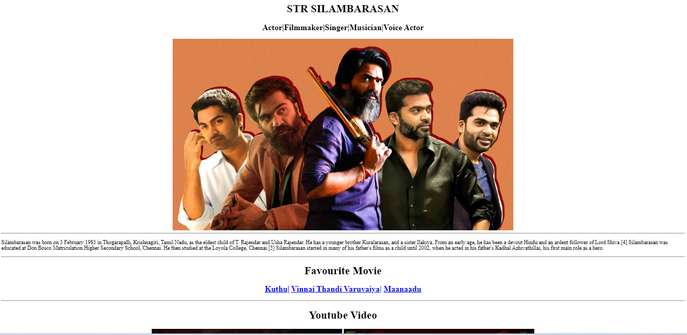

# Favorite Actor Page



This is a simple HTML project that showcases your favorite actor on a web page. It's a beginner-friendly project designed to help you learn the basics of HTML while expressing your admiration for your preferred actor or actress. 

## Table of Contents

- [Introduction](#introduction)
- [Features](#features)
- [Getting Started](#getting-started)
- [Usage](#usage)
- [Contributing](#contributing)
- [License](#license)

## Introduction

In this project, you can create a webpage dedicated to your favorite actor. You can include their biography, filmography, images, and any other details you find interesting. It's a fun way to practice your HTML skills and pay tribute to the actor who inspires you.

## Features

- **HTML-Only**: This project is built using only HTML, making it an excellent starting point for beginners to learn web development basics.

- **Customization**: You can personalize the page with your favorite actor's information, images, and style.

- **Education**: It's a hands-on learning experience to practice structuring web content with HTML tags.

## Getting Started

To get started with this project, follow these simple steps:

1. Clone the repository to your local machine.
   ```
   git clone https://github.com/your-username/favorite-actor-page.git
   ```

2. Open the `index.html` file in a web browser to view your favorite actor's page.

3. Edit the HTML content in `index.html` to add details about your favorite actor and customize the page as you like.

4. Feel free to add CSS for styling or enhance the project with JavaScript if desired.

## Usage

You can use this project to:

- Create a personal webpage dedicated to your favorite actor.
- Practice and improve your HTML skills.
- Share your admiration for your favorite actor with others.

## Contributing

Contributions are welcome! If you have ideas for improvements or new features, feel free to submit a pull request. Please follow the [Contributing Guidelines](CONTRIBUTING.md) for this project.

## License

This project is licensed under the MIT License. See the [LICENSE](LICENSE) file for details.

---

Feel free to customize this description to better fit your project and its specific details. Additionally, don't forget to create the mentioned files (e.g., CONTRIBUTING.md, LICENSE) if they are applicable to your project.
